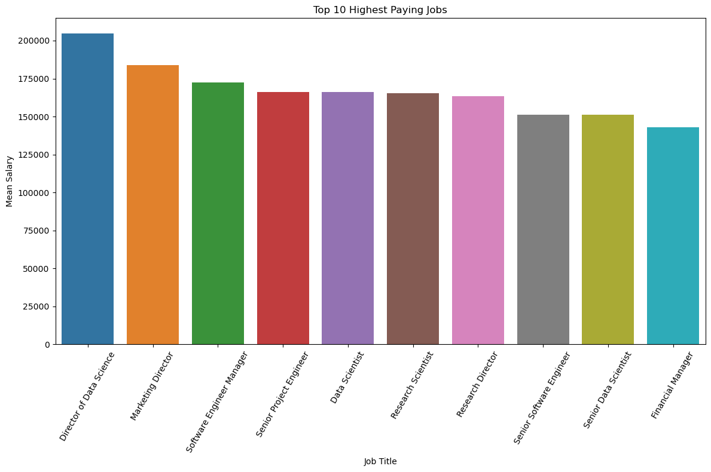
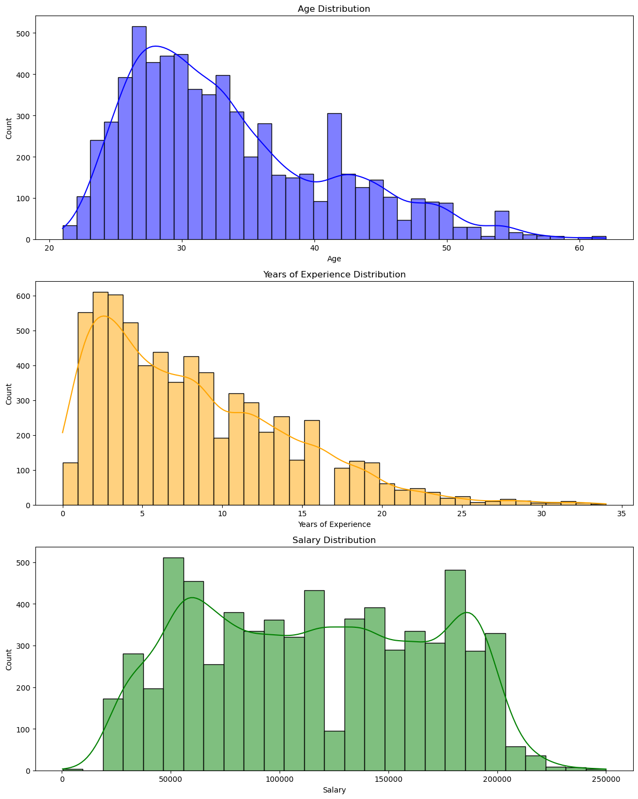
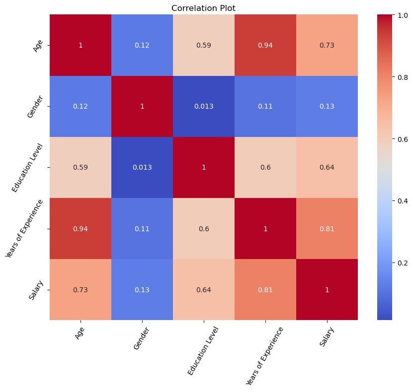
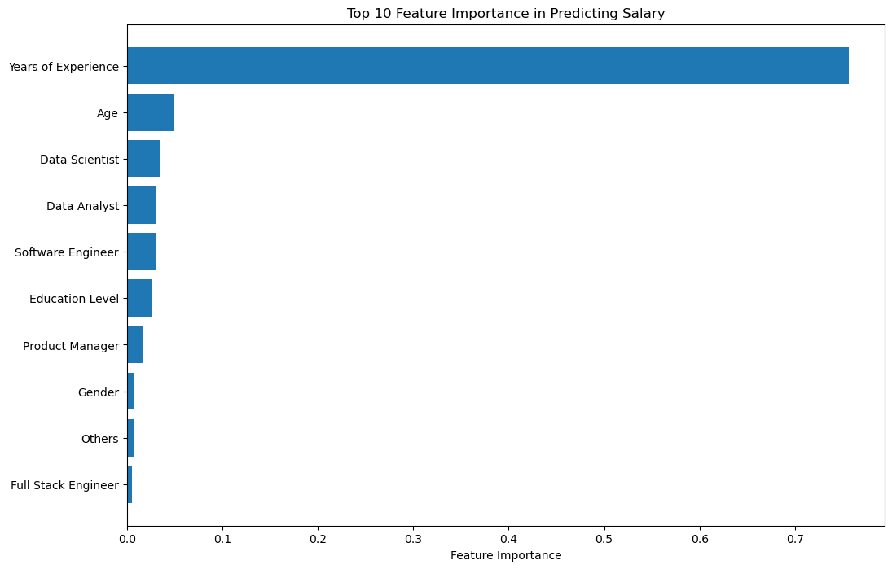

Got it! I’ve rewritten your README content to make it more concise, professional, and focused on the project workflow, removing repetitive conclusions and excessive commentary:

---

# Salary Prediction

## Introduction

This project predicts salaries based on factors such as age, gender, education level, job title, and years of experience. The dataset contains 6,704 rows and 6 columns.

## Data Preprocessing

### Handling Missing Values

Rows with missing data were removed to ensure a clean dataset for modeling.

## Data Visualization

### Top 10 Highest Earning Professions

*Bar plot showing the highest paying job titles versus mean salary.*

### Distribution of Continuous Variables

*Histogram showing the distribution of continuous features.*

### Education and Gender Distribution

*Plot showing the distribution of education levels and gender.*

### Correlation Heatmap

*Heatmap showing feature correlations.*

## Model Building

### Model Selection

We explored several machine learning algorithms, including:

* Linear Regression
* Decision Tree Regressor
* Random Forest Regressor

Hyperparameter tuning was performed using GridSearchCV to optimize model performance.

### Model Evaluation

Models were evaluated using:

* Mean Squared Error (MSE)
* Mean Absolute Error (MAE)
* Root Mean Squared Error (RMSE)
* R-squared (R2)

### Feature Importance

*Bar chart showing the relative importance of features in predicting salary.*

## Usage

1. Clone the repository.
2. Install required libraries from `requirements.txt`.
3. Run the Jupyter notebook or Python script to load the model and make predictions on new data.

---

